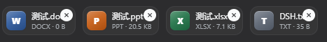
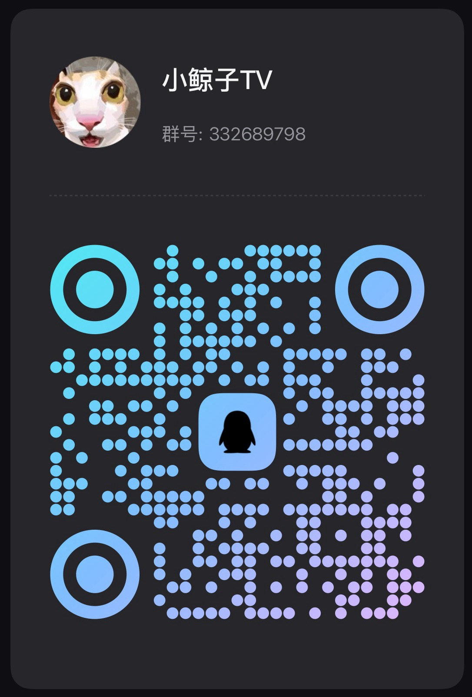

<div align="center">

# 🔭 dsh-periscope

**让 DSH Desktop 支持拖入/粘贴任意文件，agent 按路径读取。**

<br />

<p>
  <a href="https://www.dshdesktop.cn/"></a>
  
  
  <a href="./LICENSE"></a>
</p>

<p>
  <a href="https://github.com/lmh-2026/dsh-periscope/stargazers"></a>
  <a href="https://github.com/lmh-2026/dsh-periscope/forks"></a>
  <a href="https://github.com/lmh-2026/dsh-periscope/issues"></a>
</p>

<br />

<p align="center">
  <picture>
    
  </picture>
</p>

<br />

**🇨🇳 简体中文** · [English](./README.en.md)

</div>

---

## ✨ 特性

| 能力 | 说明 |
| --- | --- |
| 📎 **通用文件附件** | 原版只收图片；本工具支持拖入/粘贴**任意文件**（docx/xlsx/pdf/txt/zip…）→ 附件卡片 → 落盘 → agent 按路径读取 |
| 🗂️ **文件类型图标** | 附件卡片按扩展名显示彩色类型方块（Word 蓝 W / Excel 绿 X / PDF 红 P…） |
| 💾 **持久化落盘** | 文件保存到 `~/.dsh/attachments/v1/files/`，会话历史保留附件块与完整绝对路径 |
| 🛡️ **崩溃修复** | 修复文件草稿发送/删除时 `Cannot read properties of undefined (reading 'startsWith')` |
| 🧩 **随包核心补丁** | 6 个核心文件的替换清单 + 一键原位重打包器，改的是 DSH 桌面端核心 |

---

## ⚠️ 生效方式（重要）

文件附件**不是插件开关**，而是对 DSH 核心的直接补丁：

- DSH 核心的 `session.prompt` wire 校验 schema 是 `dsh-host-apiproxy` 模块**内部常量**，第三方插件运行时**无法扩展**。要给 DSH 增加「任意文件」能力，只能**直接修改核心**，而 `app.asar` 是一次性打包的。
- 功能是否生效，只取决于 `app.asar` **是否被打过补丁**（有没有跑过安装脚本）。**与插件列表里的任何开关无关**：打过补丁 → 生效；没打过 → 怎么设置都没用。
- `app.asar` 在每次 DSH 升级时都会被重新打包，所以**每次升级后都要重跑一次安装脚本**。

---

## 🚀 一键安装（推荐）

> **只适配 [DSH Desktop 桌面客户端](https://www.dshdesktop.cn/)**（以单个 `app.asar` 打包核心的形态）。请在 **Windows** 上操作，且**每次 DSH 升级后都要重做一次**。

本工具已发布到 npm：[`dsh-periscope`](https://www.npmjs.com/package/dsh-periscope)。仓库根目录自带一键安装脚本 `install.ps1`，一次性完成「退出检测 → 备份 → 原位重打包 `app.asar`」。

### 方式 A：从 GitHub 仓库（zip / clone）

```powershell
# 1) 完全退出 DSH Desktop
# 2) 进入仓库目录（解压 zip 或 clone 后的目录），运行：
Set-ExecutionPolicy -Scope Process Bypass -Force
.\install.ps1
```

### 方式 B：从 npm 安装

```powershell
npm install dsh-periscope
npx dsh-periscope-install
```

**脚本会自动做这几件事**：退出检测 → 备份 `app.asar` → 用本包内 `scripts/repack-inplace.mjs` 对 `app.asar` 做原位重打包（注入 6 个补丁核心文件，保留原生模块）→ 校验 + 提示重启。

### 3. 重新打开 DSH

拖入 / 粘贴一个非图片文件，即可看到带类型图标的附件卡片；发送后 agent 会按路径读取它。

---

## 📖 工作原理

文件附件功能位于 DSH **核心包**（wire 协议、附件存储、composer、模型适配器），而核心校验 schema 是 `dsh-host-apiproxy` 模块内部的常量，第三方插件运行时**无法扩展**——因此本工具随包携带对桌面端核心的**补丁**。

```text
拖入/粘贴任意文件 📎
  → composer 附件卡片（类型图标 + 文件名 + 大小，可删除）
  → 发送：文件字节(base64) 作为 {type:"file"} 部件随 prompt 上送
  → host 校验并落盘：~/.dsh/attachments/v1/files/<sha256>-<文件名>
  → 会话持久化：{type:"file", file:{name, size, path, …}} 内容块（历史渲染附件卡片）
  → 模型请求：file 块投影为文本
      [附件：名称（大小）\n完整路径：<绝对路径>\n请读取该文件内容后继续。]
  → agent 用文件工具按路径读取并处理 🔧
```

**为什么不是把文件直接发给模型？** DeepSeek 官方 [Files API 仅支持 JPEG/PNG/GIF/WebP 图片](https://api-docs.deepseek.com/zh-cn/guides/files_api/)，非图片文档无法直接送入模型。路径式消费是 agent 架构下的等价体验（Codex 同款做法）：文件真实落盘，agent 用 `read`/`bash`/`pwsh` 等工具读取。

**默认限制**：单文件 **20 MiB**、单条消息 **20 个文件**、单条合计 **200 MiB**；客户端与 host 双重校验。

---

## ⚙️ 限制配置

默认值开箱即用，也可在 `dsh-attachment-local` 插件配置中调整：

| 字段 | 默认值 | 说明 |
| --- | --- | --- |
| `maxFileBytes` | `20971520`（20 MiB） | 单个文件大小上限 |
| `maxFilesPerMessage` | `20` | 单条消息最多附件数 |
| `maxMessageFileBytes` | `209715200`（200 MiB） | 单条消息附件合计上限 |

---

## 📁 仓库结构

| 路径 | 说明 |
| --- | --- |
| `patches/manifest.mjs` | 6 个核心文件的 old→new 替换清单（约 30 处，供审查/演进） |
| `patches/asar-patched/` | 已打补丁的 6 个核心文件（重打包时直接打进 `app.asar`） |
| `scripts/repack-inplace.mjs` | 原位重打包：只替换 6 个文件，保留其余文件字节与原生模块结构 |
| `scripts/apply-file-attachments.ps1` | 一键入口：退出检测 → 备份 → 重打包 → 校验 |
| `scripts/patch-core.mjs` | `apply` / `revert` / `verify` / `diff`（面向松散核心的历史方式） |

涉及的 6 个核心包：`@deepseek-ai/dsh-attachment`、`dsh-attachment-local`、`dsh-host-apiproxy`、`dsh-llm-deepseek`、`dsh-client-ui-conversation`、`dsh-client-ui-attachment`。

---

## ❓ FAQ

**Q：DSH 升级后文件附件不能用了？**
A：正常。DSH 每次升级都会重新打包 `app.asar`，功能随之失效。重新运行一次 `apply-file-attachments.ps1` 即可（升级前先备份 `app.asar`）。

**Q：用官方 `asar extract→pack` 行不行？**
A：不行。naive 的 `extract→pack` 会孤立 unpacked 原生模块（conpty / sharp / koffi），导致 DSH 无法启动。请使用仓库自带的**原位重打包器**。

**Q：支持 Web / CLI / 源码形态吗？**
A：不支持。本工具只适配 DSH Desktop 桌面端以单个 `app.asar` 打包核心的形态。

**Q：为什么非图片文件要 agent 按路径读，而不是直接发给模型？**
A：DeepSeek 官方 Files API 只接受图片。路径式消费是 agent 架构下的等价体验。

**Q：node 路径找不到？**
A：脚本内置了 DSH runtime 与 Codex runtime 两个候选；仍不行时改 `scripts/apply-file-attachments.ps1` 里的 `$node`。

---

## ⚠️ 风险与免责声明

**本工具通过直接修改 DSH 桌面端的核心文件来工作，属于非官方行为。** 请在使用前充分了解：

| 风险 | 说明 |
| --- | --- |
| 🔄 **DSH 升级即失效** | 升级重新打包 `app.asar`，功能随之失效，需重跑脚本。 |
| 💥 **损坏与不可启动** | 重打包有误或补丁与新版核心不匹配时 DSH 可能无法启动。脚本每次自动备份 `app.asar` → `app.asar.bak`。 |
| 🧩 **内核不匹配** | 补丁针对编写时的核心版本；升级后替换项可能对不上，需按新版核心重新生成。 |
| 🔬 **非官方行为** | 修改的是核心文件而非插件 API；DSH 官方不承诺稳定。 |
| 💾 **本地落盘** | 附件明文保存到 `~/.dsh/attachments/v1/files/`，路径与块会持久化，注意隐私与磁盘占用。 |
| 📎 **非图片需 agent 读** | 非图片文档由 agent 按路径读取；`read_image` 工具自身的准入不受影响。 |
| 🧪 **仅 Windows 桌面端** | 当前脚本面向 Windows + `app.asar` 形态。 |

**还原方法**（DSH 完全退出后运行）：

```powershell
Copy-Item "D:\DSH\DSH Desktop\resources\app.asar.bak" "D:\DSH\DSH Desktop\resources\app.asar" -Force
```

> 若 DSH 已无法启动，先还原备份；如首次运行无 `.bak`，直接到 DSH 官网重新下载覆盖安装。

---

## 🗺️ 路线图

- [ ] 面向新版 DSH 核心的自动补丁重生成
- [ ] 会话导出时打包附件字节
- [ ] 支持更多平台的桌面端形态
- [ ] 上游原生支持文件附件（长期方向）

---

## 🤖 关于 vibecoding

本项目**全程由 AI 结对编程（vibecoding）完成**：需求描述、实现、调试、核心 `app.asar` 重打包器、文档均由 AI 编码代理协作产出，作者负责验证与发布。欢迎 PR / Issue。

---

## 📣 加入交流群 / 支持项目

🐧 **QQ 交流群：332689798**（小鲸子TV）——欢迎扫码加入，**提交 Bug**、交流使用心得：

<p align="center">
  
</p>

⭐ 如果觉得好用，请给项目点个 **Star** 支持一下！你的反馈能帮助它变得更好。

---

## 📄 许可证

[MIT](./LICENSE)
